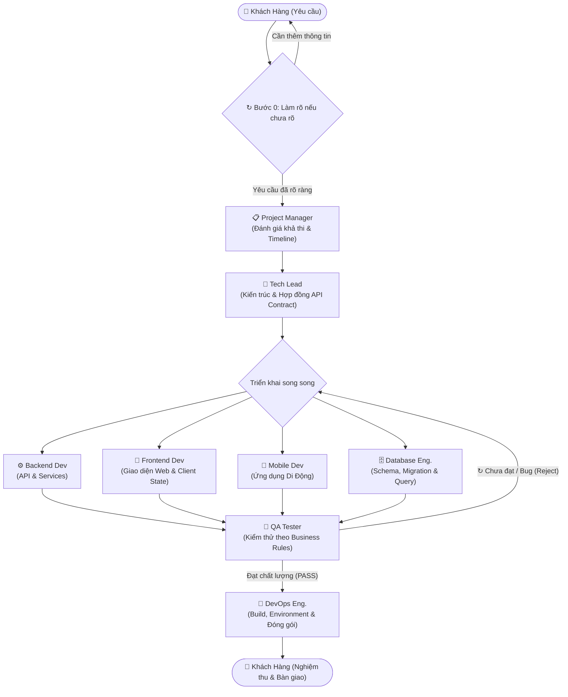

# ⚡ Squad — Hệ Thống Điều Phối Lập Trình Đa Tác Nhân (Multi-Agent Squad Orchestrator)

> **Squad** là nền tảng điều phối đa tác nhân AI (Multi-Agent Coding Orchestrator) tự động hóa quy trình phát triển phần mềm theo tiêu chuẩn doanh nghiệp: từ phân tích yêu cầu khách hàng, làm rõ phạm vi, phân rã công việc song song, thiết lập hợp đồng API & kiến trúc, lập trình chuyên biệt theo từng mảng (Backend, Frontend, Mobile, Database), kiểm thử tự động với vòng lặp từ chối (Reject Loopback), cho tới đóng gói và bàn giao DevOps.

---

## 🔄 Sơ Đồ Luồng Làm Việc Của Đội Ngũ Tác Nhân (Workflow Pipeline)

Quy trình phối hợp giữa người dùng và các Agent diễn ra theo chu trình khép kín, minh bạch và chặt chẽ:



---

## 👥 8 Vai Trò Agent Chuẩn Hóa (Tự Do Tùy Biến File `.md`)

Hệ thống quản lý persona của toàn bộ các Agent tập trung trong thư mục gốc [`agents/`](./agents/). Bạn có thể tự do mở các file markdown này để tùy chỉnh prompt, quy tắc nghiệp vụ, ràng buộc kỹ thuật hoặc model theo ý muốn:

| Vai Trò | File Persona Markdown | Trách Nhiệm Cốt Lõi |
| :--- | :--- | :--- |
| **Project Manager** | [`agents/pm.md`](./agents/pm.md) | Phân tích yêu cầu, đánh giá độ phức tạp, phân rã mục tiêu thành các tasks song song và ước lượng timeline |
| **Tech Lead** | [`agents/techlead.md`](./agents/techlead.md) | Quyết định kiến trúc hệ thống, ban hành **API Contract**, định dạng payload và quy chuẩn chia sẻ dữ liệu |
| **Backend Dev** | [`agents/backend.md`](./agents/backend.md) | Lập trình REST/GraphQL APIs, xử lý business logic, middleware xác thực, phân quyền và unit tests |
| **Frontend Dev** | [`agents/frontend.md`](./agents/frontend.md) | Phát triển giao diện web (React/Vue/HTML), tối ưu hóa trải nghiệm người dùng (UX), responsive và state |
| **Mobile Dev** | [`agents/mobile.md`](./agents/mobile.md) | Phát triển ứng dụng di động đa nền tảng (Flutter / React Native / Swift / Kotlin) bám sát API Contract |
| **Database Eng.** | [`agents/database.md`](./agents/database.md) | Thiết kế lược đồ quan hệ (3NF), viết migration scripts, đánh chỉ mục (index) và tối ưu hóa hiệu năng query |
| **QA Tester** | [`agents/qa.md`](./agents/qa.md) | Chốt chặn chất lượng: kiểm thử luồng nghiệp vụ, xác minh contract, ra quyết định **PASS** hoặc **REJECT** |
| **DevOps Eng.** | [`agents/devops.md`](./agents/devops.md) | Rà soát biến môi trường (`.env`), xác thực kịch bản build production, containerization (Docker) và bàn giao |

> **Cơ Chế Role Aliases Tương Thích Ngược:** Hệ thống tự động liên kết các vai trò tương đương: `pm` ↔ `planner`, `qa` ↔ `tester` ↔ `reviewer`, `techlead` ↔ `architect`. Mọi cấu hình hoặc kịch bản cũ đều tiếp tục hoạt động trơn tru.

---

## 🌟 Điểm Nổi Bật Về Giao Diện & Tính Năng

### 1. 💬 Giao Diện Web Chat Lập Kế Hoạch Hiện Đại (`apps/web`)
- **Modern AI Chat Style**: Thiết kế theo phong cách AI Chat hiện đại với thanh điều hướng bên trái và khung chat trung tâm.
- **Thanh Menu Đầy Đủ 6 Phân Hệ**:
  1. 💬 **Chat Lập Kế Hoạch**: Khung trò chuyện sticky, hiển thị tiến độ phân rã và điều phối agent.
  2. 🌐 **Nhà Cung Cấp Model**: Quản lý kết nối các API AI, 9Router Gateway, đo độ trễ ping và fetch danh sách models.
  3. 👥 **Thiết Lập Agent**: Cấu hình CLI Tool, Model, Duty cho 8 vai trò và tích hợp trình soạn thảo Markdown Prompt trực tiếp trên web.
  4. 🧩 **Skill, MCP & Plugin**: Nạp Model Context Protocol (MCP) servers, cheatsheet skills và extension plugins.
  5. ⚙️ **Cài Đặt Dự Án**: Tùy chỉnh chế độ thực thi (Worktree cô lập hoặc Direct in-place), số tác vụ song song tối đa, timeout.
  6. 📜 **Lịch Sử Kế Hoạch**: Tra cứu nhật ký các lần chạy, xem lại timeline và báo cáo chi tiết.
- **Giám Sát Tác Vụ Thời Gian Thực (Live Sub-Agent Matrix)**:
  - Khi kích hoạt kế hoạch, giao diện hiển thị danh sách từng agent chuyên trách đang nhận việc nào.
  - Tích hợp cửa sổ **Live Terminal Logs (SSE Stream)** xem trực tiếp dòng code và lệnh terminal agent đang gõ.
  - Nút **Hợp Nhất Nhánh (Merge Action)** 1-click khi QA đã nghiệm thu thành công toàn bộ tasks.

### 2. ⚡ Real-Time Server Health & Header Thao Tác Nhanh
- **Đo Ping Mili-Giây (`ms`)**: Heartbeat định kỳ 3 giây tới backend server `GET /health`.
- **Bộ Chọn Thư Mục Dự Án**: Dễ dàng chuyển đổi giữa các git repository đang được quản lý.
- **Dual Theme Liquid Glass**: Chuyển đổi linh hoạt giữa **Dark Mode (Obsidian Glass)** và **Light Mode (Crystal Milk Glass)** với hiệu ứng làm mờ nền (frosted backdrop blur) và viền phản quang cao cấp.

### 3. 🚀 Tích Hợp 9Router Local AI Gateway
- Kết nối mặc định tới 9Router (`http://127.0.0.1:20128/v1`).
- Tự động gom nhiều tài khoản AI (Claude, OpenAI, Gemini, OpenRouter), cân bằng tải round-robin và chống lỗi rate limit 429 khi nhiều coding agents chạy song song cùng lúc.

---

## 🏗️ Cấu Trúc Monorepo

```
AI_System/
├── agents/             # Thư mục 8 file Persona Markdown của từng vai trò (.md)
│   ├── pm.md           # Project Manager
│   ├── techlead.md     # Tech Lead (Architecture & API Contract)
│   ├── backend.md      # Backend Developer
│   ├── frontend.md     # Frontend Developer
│   ├── mobile.md       # Mobile Developer
│   ├── database.md     # Database Engineer
│   ├── qa.md           # QA Tester
│   └── devops.md       # DevOps Engineer
├── packages/
│   ├── core/           # Động cơ điều phối cốt lõi
│   │   ├── src/stages/ # Các giai đoạn mô-đun: Clarification (B0), TechLead, DevOps
│   │   ├── runner.ts   # Điều phối Git Worktrees / Direct execution & QA Loopback
│   │   └── store.ts    # Lưu trữ SQLite & sự kiện SSE
│   ├── cli/            # Giao diện dòng lệnh (squad plan, run, merge, clean)
│   ├── server/         # REST API Fastify + SSE streaming + /health
│   └── shared-types/   # DTOs, schemas, pipeline contracts dùng chung
├── apps/
│   └── web/            # Ứng dụng Web Dashboard React 19 + Vite + Tailwind + Liquid Glass UI
├── docs/               # Tài liệu thiết kế kiến trúc và lộ trình
├── squad.config.json   # File cấu hình trung tâm cho đội ngũ Agent
└── package.json        # Root workspace cấu hình pnpm
```

---

## 🛠️ Hướng Dẫn Cài Đặt & Vận Hành

### Yêu Cầu Môi Trường
- **Node.js**: `>= 20.0.0`
- **pnpm**: `>= 9.0.0`
- **Git**: `>= 2.30.0`

### 1. Cài Đặt Thư Viện
```bash
pnpm install
```

### 2. Biên Dịch Mã Nguồn
```bash
pnpm -r build
```

### 3. Chạy Toàn Bộ Test Suite
Dự án được bảo đảm chất lượng với **87/87 tests (100% pass)**:
```bash
pnpm -r test
```
*Chi tiết các gói kiểm thử:*
- `@squad/core`: 43 tests
- `@squad/server`: 18 tests
- `@squad/cli`: 8 tests
- `@squad/web`: 18 tests

### 4. Khởi Động Môi Trường Phát Triển Cục Bộ

Mở 2 cửa sổ terminal:

**Terminal 1 — Fastify Backend API Server (Port 4317):**
```bash
pnpm dev:server
# Server lắng nghe tại: http://127.0.0.1:4317
```

**Terminal 2 — React Web Dashboard (Port 5173):**
```bash
pnpm dev:web
# Truy cập giao diện tại: http://localhost:5173
```

---

## ⚙️ Cấu Hình Mẫu `squad.config.json`

File `squad.config.json` định nghĩa các thiết lập thực thi và danh sách tác nhân trong dự án:

```json
{
  "configVersion": 1,
  "baseBranch": "main",
  "integrationBranch": "squad/integration",
  "worktreeDir": ".squad/worktrees",
  "dbFile": ".squad/squad.db",
  "planFile": ".squad/plan.json",
  "logDir": ".squad/logs",
  "maxParallel": 3,
  "timeoutMinutes": 30,
  "executionMode": "direct",
  "maxReviewRounds": 2,
  "verify": [],
  "agents": {
    "default": { "cli": "9router", "model": "ag/gemini-3.8-flash-high" },
    "pm": { "cli": "9router", "model": "ag/gemini-3.8-flash-high" },
    "techlead": { "cli": "9router", "model": "ag/gemini-3.8-flash-high" },
    "backend": { "cli": "9router", "model": "ag/gemini-3.8-flash-high" },
    "frontend": { "cli": "9router", "model": "ag/gemini-3.8-flash-high" },
    "mobile": { "cli": "9router", "model": "ag/gemini-3.8-flash-high" },
    "database": { "cli": "9router", "model": "ag/gemini-3.8-flash-high" },
    "qa": { "cli": "9router", "model": "ag/gemini-3.8-flash-high" },
    "devops": { "cli": "9router", "model": "ag/gemini-3.8-flash-high" }
  }
}
```

---

## 📜 Giấy Phép
Dự án được phát triển và phân phối dưới giấy phép **MIT License**.
